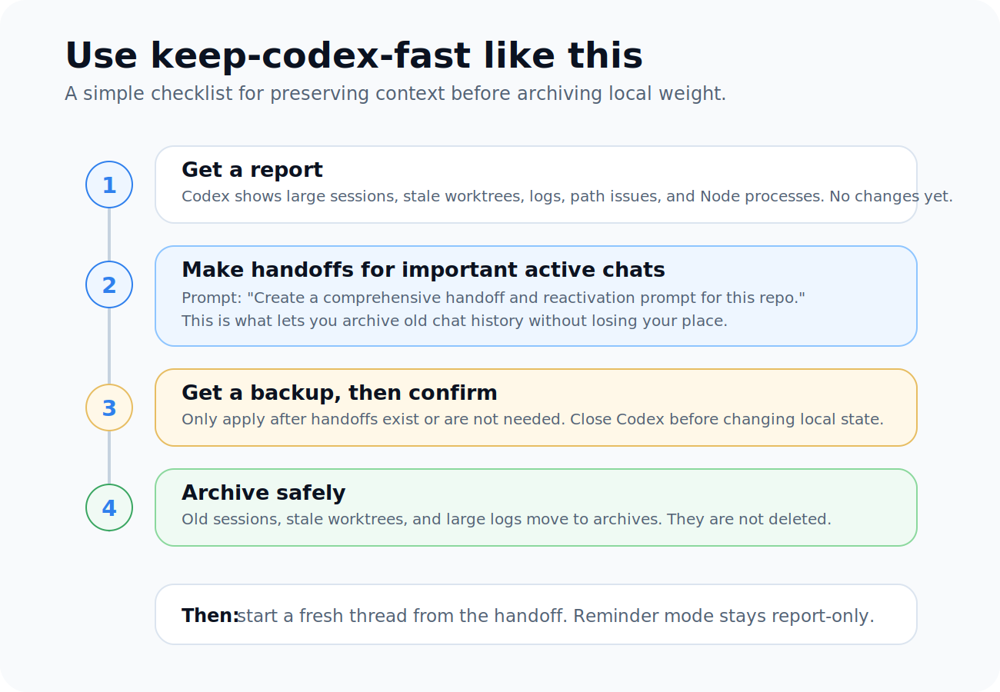

# Keep Codex Fast


When Codex starts feeling heavy after weeks of chats, terminals, logs, worktrees, and project history, this gives you a calm way to inspect what is going on and reduce local drag.

This skill helps you organize local state without losing context.

The rule is simple:

> Make handoffs first. Archive, don't delete. Apply changes only when you are ready.

## Three Modes

- **Inspect:** report-only, no writes.
- **Maintain:** normal apply; backs up, archives old sessions, moves stale worktrees, rotates logs, prunes dead config, and normalizes paths. It does not trim thread title/preview metadata.
- **Optional repair:** only with `--apply --repair-thread-metadata-bloat`; shortens oversized SQLite display title/preview metadata after backup. The transcript stays intact.

## Who This Is For

Use this if Codex has started feeling slower after heavy use, especially if you:

- keep long chats around
- resume old threads often
- work across many repos
- run multiple terminals or dev servers
- want maintenance to feel safe, not scary

## What It Does

By default, this skill only reports. It does not write files, create backups, move folders, or change local Codex state until you explicitly ask it to.

It helps Codex:

- see which local state has grown over time
- create handoff docs before archiving old chats
- back up important state before applying changes
- archive old chats instead of deleting them
- detect pathological thread title/preview metadata that can slow chat navigation
- move stale worktrees out of the hot path
- rotate large logs
- prune dead project references
- report heavy Node/dev processes without killing them

## Quick Start

Ask Codex:

```text
Use $keep-codex-fast to inspect my Codex local state and recommend a safe maintenance plan.
```

Codex should show you what it found first. Then you decide what to hand off, what to keep active, and what can be archived.

## Handoffs First

Before archiving old active chats, create handoff documents for any repo/session you may want to continue.

A handoff is a small continuity note. It captures:

- what you were doing
- what changed
- what files matter
- what commands or checks already ran
- what is still broken or undecided
- what to do next

That lets you archive the heavy chat and start a fresh Codex thread from the handoff.

Copy this into each active repo chat you care about:

```text
Create a comprehensive handoff document for this repo/session before I archive Codex history.

Include:
- repo/path and branch
- current goal
- what we already completed
- files touched or investigated
- commands/tests already run
- known errors, warnings, or failing checks
- open decisions
- constraints, user preferences, and do-not-touch areas
- the next 3-7 concrete steps

Also include a reactivation prompt I can paste into a fresh Codex chat so it can continue from this handoff without relying on the old chat context.

Save the handoff in a sensible repo-local place like docs/codex-handoffs/YYYY-MM-DD-topic.md unless this repo already has a better handoff location.
```

## Safe Apply

After handoffs exist for the chats you care about, use this:

```text
Use $keep-codex-fast to apply safe Codex maintenance.

Before changing anything, confirm that important active repo chats have handoff docs or do not need them.

Then back up first, archive instead of deleting, move stale worktrees, rotate large logs, prune dead config references, and verify the result.

If Codex is currently running, do not mutate local state. Tell me to close Codex first.
```

## Thread Title And Preview Bloat

Some Codex builds can store a full first user prompt as both the thread title and the list preview. When those fields grow into hundreds of thousands of characters, thread navigation can become sluggish even before a large chat is opened.

The script reports title and preview payload size in report mode and normal apply mode. It does not trim this metadata unless you explicitly opt in:

```bash
python scripts/keep_codex_fast.py --apply --repair-thread-metadata-bloat
```

With that flag, after backing up and only when Codex is not running, it trims active SQLite title/preview metadata to bounded display values. It also appends repaired titles to `session_index.jsonl`, which matches current Codex name-update storage.

This does not remove the actual conversation transcript. The full rollout JSONL remains available unless you separately archive the session.

The repair manifest stores the old full title/preview values so you can restore them. Keep the backup folder private, especially `thread-metadata-repairs.jsonl` and `restore-thread-metadata.py`.

If you are using the skill normally, this repair does not happen automatically. Treat it as an extra recommendation only when the report shows unusually large title/preview metadata.

## Weekly Or Biweekly Reminder

Recurring maintenance should be a reminder, not an automatic apply.

Why: an automation cannot know whether you created handoffs for chats you still care about. It should inspect and remind you, but not archive, move, prune, rotate, normalize, delete, or mutate anything by itself.

Copy this into Codex:

```text
Use $keep-codex-fast to create a recurring Codex maintenance reminder.

Schedule it weekly if I use Codex heavily, or biweekly if that seems safer.

The reminder should:
- run the keep-codex-fast report first
- never pass --apply or run mutating maintenance automatically
- never archive, move, prune, rotate, normalize, delete, or mutate local Codex state
- remind me to create comprehensive handoff docs and reactivation prompts for active repo chats before any manual apply
- summarize active session size, archived session size, extended path candidates, old session candidates, worktree candidates, log size, and top Node/dev processes
- report heavy Node/dev processes without killing them
- tell me that manual apply should only happen after I confirm handoffs exist or are not needed and Codex is closed
```

## Install

Ask Codex:

```text
Install the keep-codex-fast skill from https://github.com/vibeforge1111/keep-codex-fast
```

Or clone/copy this folder into your Codex skills directory as `keep-codex-fast`.

## Advanced: Manual Script Use

Most users can stay inside Codex and use the prompts above. The script is here for people who want to run it directly.

Report only. This is read-only and privacy-safe by default:

```bash
python scripts/keep_codex_fast.py
```

Show raw thread IDs, chat titles, paths, and process paths only when you need detail:

```bash
python scripts/keep_codex_fast.py --details
```

Create backups only, without moving or changing local state:

```bash
python scripts/keep_codex_fast.py --backup-only
```

Backup folders can contain private local Codex metadata. Keep them on your machine, and do not publish or share them unless you have reviewed what is inside.

Apply core maintenance actions. This does not trim thread title/preview metadata:

```bash
python scripts/keep_codex_fast.py --apply --archive-older-than-days 10 --worktree-older-than-days 7
```

Optionally repair oversized title/preview metadata only when the report recommends it:

```bash
python scripts/keep_codex_fast.py --apply --repair-thread-metadata-bloat
```

Wait for Codex to exit before applying:

```bash
python scripts/keep_codex_fast.py --apply --wait-for-codex-exit
```

## What Can Change

The skill can safely handle:

- old non-pinned active sessions
- stale worktrees
- large `logs_2.sqlite*` files
- dead/temp project entries in `config.toml`
- Windows `\\?\C:\...` path mismatches in local SQLite text fields
- oversized thread title and first-message preview metadata in `state_5.sqlite`, only with `--repair-thread-metadata-bloat`

It does not permanently delete chats, logs, or worktrees. It moves them into archive folders and writes backup/restore artifacts before applying changes.

## Mental Model

- Chats are for execution.
- Handoff docs are for memory.
- Archives are for history.
- Fresh threads are for speed.

## Flow


